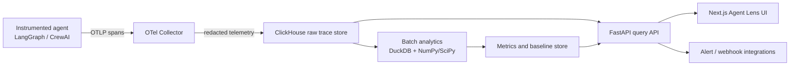

# Agent Lens — Product and Technical Architecture

**Status:** Foundation blueprint  
**Last updated:** 2026-07-30  
**Audience:** product, platform, data, and application engineers

## 1. Product definition

Agent Lens is a self-hosted observability and evaluation platform for agentic AI systems. It answers a question conventional APM cannot: *did an agent execution achieve its intended outcome efficiently and safely, even when its HTTP request succeeded?*

The first supported sources are LangGraph and CrewAI executions instrumented with OpenTelemetry (OTel) and OpenInference conventions. The platform receives trace data, protects sensitive payloads, computes deterministic drift signals asynchronously, and presents actionable findings to engineering and product teams.

### Core outcomes

- Detect behavior that has drifted from a known-good execution population.
- Distinguish likely ambiguous input from likely agent/tool logic defects.
- Expose trajectory waste: excess steps, tokens, retries, latency, and cost.
- Keep raw telemetry in a customer-controlled analytical store.
- Provide explainable scores; LLM-based judging is optional and never on the critical ingest path.

### Explicit non-goals for the first release

- Guaranteeing factual correctness from mathematical signals alone.
- Blocking an individual agent call inline.
- Supporting every agent framework before the LangGraph/CrewAI path is reliable.
- Unrestricted natural-language SQL against production telemetry.

## 2. User roles and primary journeys

| Role | Question | Agent Lens response |
| --- | --- | --- |
| Agent engineer | “Why did this run fail after returning 200?” | Trace timeline, tool path, score breakdown, comparable baseline executions. |
| Platform/SRE engineer | “Which deployment is wasting resources?” | Trends by service, model, version, tool, and environment with alerts. |
| Product owner | “Is user ambiguity or the agent causing the regression?” | Root-cause classification with confidence and supporting measurements. |
| Privacy/admin owner | “What data is retained and who can see it?” | Redaction status, retention policy, tenancy/RBAC audit trail. |

## 3. System context

### Boundary and trust model

1. **Agent boundary:** applications emit trace context and OpenInference attributes. They should not need to know the data model of the dashboard.
2. **Collection boundary:** the collector is the sole normal ingress. Redaction and payload-size limits happen before persistence.
3. **Data boundary:** ClickHouse holds immutable raw telemetry and derived facts. It is not exposed directly to browsers.
4. **Analytics boundary:** scheduled jobs read a bounded time window, produce versioned baselines and metric records, and are idempotent.
5. **Serving boundary:** FastAPI enforces auth, tenant scope, query limits, and a typed API contract. Text-to-SQL is an optional constrained capability behind this boundary.

## 4. Domain model and data contracts

The unit of analysis is an **execution**: all spans sharing a `trace_id` for one agent request. A span remains the atomic event.

| Entity | Required identity | Purpose |
| --- | --- | --- |
| Tenant | `tenant_id` | Data isolation and authorization scope. |
| Agent version | `service_name`, `agent_name`, `agent_version`, `environment` | Separates baselines across materially different agent releases. |
| Execution | `trace_id`, `started_at` | One user-visible agent run. |
| Span | `trace_id`, `span_id`, `parent_span_id` | Node, model, tool, retrieval, or handoff event. |
| Baseline | `baseline_id`, segment keys, `metric_version` | Approved reference population and statistical parameters. |
| Drift metric | `execution_id`, `baseline_id`, `metric_version`, `computed_at` | Reproducible result for one execution. |
| Finding | `finding_id`, severity, lifecycle | User-facing diagnosis/alert derived from metrics. |

### Minimum ingestion contract

Every trace must contain W3C trace identifiers, timestamp, service name, span name/kind, duration, and status. Agent spans additionally need, where available:

- `agentlens.tenant_id`, agent name/version, environment, and release identifier.
- OpenInference-compatible model, tool, input/output, token, and invocation attributes.
- A bounded `input_hash` and `output_hash`; raw content is opt-in after redaction.
- Cost currency/rate metadata or the model/provider values from which cost can be calculated.

Missing optional attributes must degrade a metric to `unavailable`, never to zero. The API should surface data-quality coverage alongside every score.

### Storage layers

| Layer | Store | Retention | Notes |
| --- | --- | --- | --- |
| Raw spans | ClickHouse | 30 days initially | Partition by day and tenant; TTL must be tested. |
| Trace rollups | ClickHouse | 90 days initially | One execution-level row for dashboard queries. |
| Drift metrics/findings | ClickHouse | 13 months initially | Versioned results, not overwritten in place. |
| Baselines | ClickHouse/object storage | Until superseded + audit period | Serialize model parameters and training cohort metadata. |

Use explicit schema migrations. Do not depend on an exporter creating a table with an assumed shape; its version and schema mapping must be integration-tested.

## 5. Deterministic analytics design

All scoring runs against a declared `metric_version`, baseline, and threshold configuration. This makes results reproducible when formulas or embeddings change.

### 5.1 Trajectory distance — `D_M`

Build a vector `x` from an output embedding plus normalized, stable path features (for example tool counts, transition frequencies, and terminal state). Compare it with the segment’s approved baseline mean `μ` and regularized covariance `Σ`:

`D_M(x) = sqrt((x - μ)^T Σ^-1 (x - μ))`

Operational safeguards:

- Segment baselines by tenant, agent version, intent/use case, and embedding model/dimension.
- Require a configurable minimum sample count before publishing a baseline.
- Use covariance regularization and a pseudo-inverse; record the regularization setting.
- Treat unseen tool names, dimension mismatch, and sparse cohorts as data-quality conditions, not ordinary drift.

### 5.2 Input ambiguity — `H_amb`

Combine token-distribution entropy with semantic dispersion from approved intent centroids:

`H_amb(Q) = -Σ P(xᵢ) log₂ P(xᵢ) + α(1 - (1/m)Σ cos(q, cⱼ))`

The tokenization and embedding model are part of `metric_version`. Because entropy can correlate with language, length, and domain vocabulary, calibrated thresholds must be per segment and monitored for false positives.

### 5.3 Trajectory volatility — `V_traj`

`V_traj = wₛ(N_steps/N̄)² + wₜ(T_used/T̄) + wᵣΣRᵢ²`

Persist both raw components and weights. A UI slider may simulate alternative weights but must label the result as a simulation; it may not alter historical computed facts.

### 5.4 Classification policy

Initial deterministic policy:

| Condition | Classification |
| --- | --- |
| `D_M` below calibrated threshold and no severe volatility | Compliant |
| High `D_M` and high `H_amb` | Likely user-prompt ambiguity |
| High `D_M` and low `H_amb` | Likely agent logic failure |
| Timeout/error span or retry threshold exceeded | Tool/runtime failure |
| Insufficient baseline or source data | Unclassified / insufficient evidence |

This is a triage signal, not causal proof. The product must display the classification rationale, confidence/data coverage, and raw trace link.

## 6. Service architecture

### Telemetry collector

Start with OTLP gRPC/HTTP receivers, memory limiting, batching, resource detection, transform/redaction, and a ClickHouse-compatible exporter. Configure backpressure, retry queues, and a dead-letter/diagnostic path. The collector configuration must be validated against the exact contrib image, because exporter support and table mappings vary by release.

### ClickHouse

Use separate raw-span, trace-rollup, metric, baseline, and finding tables. Partition on date and tenant-aware keys; order according to the most frequent filter pattern (`tenant`, `environment`, `service`, time). Store large raw prompts/output payloads separately or encrypted with strict TTL to prevent high-cardinality dashboard scans.

### Analytics worker

Implement as a containerized scheduled worker before introducing a workflow orchestrator. It performs: extract window → validate → aggregate trace features → embed (if configured) → baseline selection → score → classify → persist → emit job audit record. A rerun with the same inputs/configuration must be safe.

### API

Expose typed endpoints for health, trace search/detail, metric trends, findings, baseline lifecycle, configurations, and dashboard summaries. Apply authentication, tenant filtering, pagination, rate limits, and query timeouts centrally. Text-to-SQL, if added, uses read-only credentials, an allowlisted semantic layer, AST validation, row/time limits, and query audit logs.

### Frontend

Build around three views: executive overview, investigation, and configuration. The first release should prioritize trace-to-finding explainability over polished natural-language querying.

## 7. Security, privacy, and reliability requirements

- Redact secrets and sensitive identifiers before storage; never rely on UI masking as the control.
- Support configurable raw-content capture (`off`, `redacted`, `restricted`) and hash-only correlation.
- Encrypt in transit; use scoped service credentials and role-based access control.
- Record access and administrative changes in audit logs.
- Enforce retention through tested TTL policies and provide deletion workflows for tenant data.
- Define availability and loss semantics: telemetry may be sampled/dropped under overload, and the platform must measure/report drops.
- Prevent cross-tenant baselines and queries by construction and test this isolation.

## 8. Decision record summary

| ID | Decision | Status |
| --- | --- | --- |
| ADR-001 | Asynchronous mathematical evaluation is the default; LLM judging is optional. | Accepted |
| ADR-002 | ClickHouse stores telemetry; DuckDB/NumPy/SciPy perform batch analysis. | Accepted |
| ADR-003 | OTel + OpenInference are the framework-neutral instrumentation contract. | Accepted |
| ADR-004 | FastAPI is the typed API boundary; natural-language query is constrained and later. | Updated from draft |
| ADR-005 | Client-side tuning is simulation only; persisted production thresholds are versioned configs. | Updated from draft |

## 9. Open decisions to resolve before production

1. Identity and tenancy model: single tenant first or enforced multi-tenant from day one.
2. Embedding provider/model, data residency, and whether embeddings may leave the customer network.
3. Baseline approval workflow and the ground-truth labels used to validate classifications.
4. Trace sampling policy and maximum payload/token limits.
5. Authentication provider, RBAC roles, and audit retention requirements.
6. Alert destinations and severity/SLO definitions.

## 10. Success criteria for an MVP

An MVP is complete when a developer can instrument a sample LangGraph or CrewAI agent, see a redacted trace in Agent Lens, run a repeatable batch job, inspect a versioned drift finding with its score inputs, and use the dashboard to navigate from a trend to the underlying execution. It must do this without an LLM evaluation call on the ingestion or scoring path.
