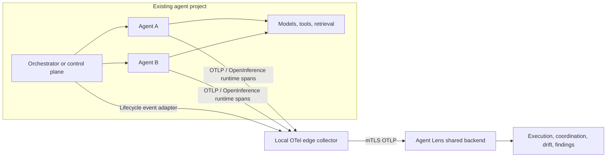

# Agent Lens Product Positioning and Ecosystem Integration

**Status:** Proposed product strategy and integration blueprint  
**Last updated:** 2026-08-01  
**Design partner:** agent-synthetix / AutoClaw  
**Audience:** product, platform, agent-framework, SRE, security, and application teams

## 1. Executive Position

Agent Lens is the framework-neutral behavior assurance layer for production AI agents.

It converts standard agent telemetry and orchestration events into explainable evidence about execution quality, behavioral drift, coordination failure, resource waste, and operational risk. Agent Lens does not replace an agent framework, multi-agent orchestrator, control plane, or general-purpose APM. It plugs into those systems through OpenTelemetry and OpenInference and gives their operators a shared way to answer:

> Did the agent fleet behave as intended, what changed, and where should a human intervene?

### Public one-line description

**Agent Lens shows when AI agents drift, waste resources, or fail to coordinate—across frameworks and clouds, without putting an LLM judge in the request path.**

### Category

**Agent behavior observability and assurance**, positioned between:

- agent runtimes and multi-agent control planes;
- standard infrastructure observability;
- offline evaluation and governance systems.

### Strategic wedge

Start with multi-agent engineering systems where failures are expensive, state crosses several agents, and conventional request-level monitoring cannot explain the outcome. Use agent-synthetix as the first reference integration, then generalize the same contracts to LangGraph, CrewAI, OpenAI Agents SDK, Microsoft Agent Framework/Semantic Kernel, Google ADK, AutoGen, and custom orchestrators.

## 2. Problem and Jobs-to-be-Done

### Core problem

Agent systems can return HTTP 200 while still producing the wrong trajectory: excessive handoffs, repeated tool calls, stalled peers, approval loops, scope collisions, weak evidence, or behavior that has drifted from a known-good release. Infrastructure APM sees latency and errors. Framework-native tracing sees individual runs. Teams still lack a portable assurance layer that correlates execution behavior with orchestration decisions and approved baselines.

### Primary Jobs-to-be-Done

| Persona | When | Job | Desired evidence |
| --- | --- | --- | --- |
| Agent engineer | A run fails, degrades, or becomes expensive | Explain the exact model/tool/handoff trajectory | Trace tree, retries, token use, anomalous path, comparable baseline |
| Multi-agent platform owner | Agents work concurrently across tools or IDEs | Know whether the fleet is progressing safely | Assignment-to-outcome timeline, stalls, collisions, reviews, consensus, completion proof |
| SRE/platform engineer | A deployment or provider changes | Detect operational and behavioral regressions | Version-segmented trends, freshness, errors, replay, saturation, drift findings |
| Product owner | User outcomes decline | Separate ambiguous requests from agent logic or tool failures | Explainable classification with data-quality coverage and evidence |
| Security/privacy owner | Agent telemetry contains sensitive context | Prove what is captured, retained, and accessible | Hash-only durable content, transient TTL, tenant isolation, access audit |
| Engineering leader | Agent adoption grows across teams | Compare reliability without forcing one framework | Common KPIs and contracts across agent ecosystems |

## 3. Positioning

### Positioning statement

For engineering organizations operating production AI agents across frameworks, Agent Lens is a self-hosted behavior observability and assurance platform that detects drift, coordination failure, and trajectory waste from standard telemetry. Unlike framework-bound trace viewers or inline LLM judges, Agent Lens preserves framework choice, keeps evaluation asynchronous and explainable, and supports customer-controlled deployment across Kubernetes environments.

### Differentiation pillars

1. **Framework-neutral by contract** — OTLP and OpenInference are the primary interface; SDKs are optional adapters.
2. **Behavior, not only infrastructure** — measures tool paths, retries, handoffs, ambiguity, volatility, and baseline distance.
3. **Multi-agent correlation** — joins runtime spans with assignment, heartbeat, review, consensus, and outcome events.
4. **Deterministic first** — mathematical scoring is reproducible and asynchronous; LLM judging remains optional.
5. **Privacy by architecture** — raw prompt/output content is not durably required; hashes and short-lived encrypted candidates support correlation and scoring.
6. **Customer-controlled operations** — self-hosted Compose/Kubernetes deployment with AKS, EKS, and generic Kubernetes support.

### What Agent Lens is not

- It is not an agent builder or orchestration engine.
- It does not assign tasks, approve plans, merge branches, or execute tools.
- It is not a replacement for infrastructure APM, logs, or cloud monitoring.
- It does not claim causal proof or factual correctness from drift signals alone.
- It does not require teams to replace their existing framework-native observability.

## 4. Product Architecture: Two Complementary Signal Planes

Agent Lens should treat every integration as two optional, composable planes.



### Runtime telemetry plane

Captures the work performed by agents:

- agent and workflow invocation;
- model calls and token usage;
- tool and retrieval calls;
- errors, timeouts, retries, and latency;
- inputs/outputs under the configured privacy mode;
- parent/child trace relationships.

### Orchestration telemetry plane

Captures why and how work moved through the fleet:

- plan and task identity;
- assignment and dependency state;
- agent/session identity and heartbeat;
- claim, handoff, stall, revive, and completion;
- review, consensus, approval, rejection, and merge;
- evidence references and quality-gate outcomes.

Runtime telemetry alone explains execution. Orchestration telemetry alone explains coordination. Their correlation explains the system.

## 5. Reference Integration: agent-synthetix / AutoClaw

### Verified product shape

AutoClaw is a file-native, tool-agnostic multi-agent operating system. Its host AI agent executes Markdown rules and materializes operational state under `.autoclaw/`. It exposes deterministic evidence through sprint YAML files, a command queue, agent inboxes, heartbeats, consensus records, review reports, audit/log JSONL files, and state/board JSON. Its optional Vite console reads and writes that file contract.

This means Agent Lens should not require AutoClaw to become a long-running application server. Integration must preserve its local-first, file-native design.

### Recommended integration pattern

Build a small **AutoClaw-to-OTLP bridge** as an optional companion, not a dependency of AutoClaw core.

The bridge tails only allowlisted runtime files, converts state transitions into OpenTelemetry spans/events, maintains a local watermark for idempotency, and exports through the same local edge collector used by runtime agents.

#### Sources and emitted operations

| AutoClaw source | Agent Lens operation | Span/event purpose |
| --- | --- | --- |
| `plans/status.yaml` | `autoclaw.project.plan` | Intake, clarification, proposal, approval, manifestation lifecycle |
| `sprints/sprint-N.yaml` | `autoclaw.sprint` | Sprint state from pending through merged |
| `state.json` / `board.json` | `autoclaw.task` | Task assignment, in-progress, review, completion, or stuck state |
| `commands/pending.jsonl` | `autoclaw.command.enqueue` | Command request latency and backlog |
| `commands/processed.jsonl` | `autoclaw.command.process` | Command outcome and queue-to-completion latency |
| `comms/comms-log.jsonl` | `autoclaw.coordination` | Claim, handoff, revive, and other coordination events |
| `comms/heartbeats/*.json` | `autoclaw.agent.heartbeat` | Liveness and stall detection; metric/event rather than one span per heartbeat at scale |
| `comms/consensus/**` | `autoclaw.consensus` | Votes, quorum, rejection, and time-to-decision |
| `reviews/sprint-N-review.md` | `autoclaw.review` | Quality-gate result and review turnaround |
| `audit/*.jsonl` | `autoclaw.audit` | Administrative and lifecycle evidence |
| `autobuild/runs/*.log` | `autoclaw.quality_gate` | Build/test/deploy gate status and duration |
| `mateam/scratch/<session>/` | `autoclaw.role_pipeline` | Researcher → Coder → Reviewer → Verifier stage progression |

### Trace hierarchy

Use one trace per approved project execution or sprint, depending on duration and backend trace limits:

```text
project / sprint trace
├── plan or sprint lifecycle
├── task assignment
│   ├── agent execution
│   │   ├── model calls
│   │   ├── tool calls
│   │   └── handoffs
│   └── task completion evidence
├── peer review
├── consensus
├── quality gates
└── merge outcome
```

Long-running projects should use linked traces rather than one unbounded trace. Persist stable correlation identifiers across trace links.

### Correlation contract

AutoClaw task-assignment and context-pack records should optionally carry:

- W3C `traceparent` and `tracestate`;
- `agentlens.project.id`;
- `agentlens.plan.version`;
- `agentlens.sprint.id`;
- `agentlens.task.id`;
- `agentlens.assignment.id`;
- `agentlens.agent.id` and `agentlens.session.id`;
- repository and commit identifiers;
- framework/host name such as Codex, Claude Code, Cursor, or Antigravity.

Spawned agent processes inherit `OTEL_EXPORTER_OTLP_ENDPOINT`, resource attributes, and trace context where the host supports it. Hosts without propagation still emit independently and are joined by stable task/assignment identifiers.

### Privacy boundary

The bridge must never export file bodies, prompts, context packs, source code, review prose, or inbox payloads by default. It exports state, timestamps, bounded identifiers, counts, verdicts, durations, and HMACs of content when correlation is necessary. This aligns AutoClaw’s local-first contract with Agent Lens’s hash-only durable policy.

### AutoClaw-specific dashboards and findings

- Fleet throughput: verified tasks completed per week.
- Human repair rate after agent completion.
- Assignment-to-first-heartbeat latency.
- Stalled-agent rate and mean time to revive.
- Handoff count and handoff-loop rate.
- Review turnaround and request-changes rate.
- Consensus latency, quorum failure, and security-vote rejection.
- Scope-conflict and dependency-blocked rate.
- Quality-gate failure and retry rate.
- Token/tool/latency cost per verified task.
- Behavioral drift by agent host, model, task family, repository, and release.

### Integration ownership

| Component | Recommended home | Reason |
| --- | --- | --- |
| Canonical lifecycle attribute contract | Agent Lens | Shared across orchestrators |
| AutoClaw file-to-OTLP bridge | Agent Lens integration package or separate adapter repo | Keeps AutoClaw core serverless and optional |
| Optional trace fields in task/context records | agent-synthetix | Native context propagation requires producer support |
| Runtime SDK bootstrap templates | Both projects’ examples/docs | Lowest-friction adoption |
| AutoClaw dashboard preset | Agent Lens | Presentation and scoring concern |
| Integration conformance fixture | Both projects | Prevents contract drift |

## 6. Plug-in Model for Other Agent Ecosystems

### Integration levels

| Level | Integration | Customer effort | Capability |
| --- | --- | --- | --- |
| L0 | Existing OTLP endpoint redirect | Environment/config only | Model/tool traces and infrastructure correlation |
| L1 | OpenInference auto-instrumentation | Small bootstrap dependency | Rich agent, model, tool, retrieval semantics |
| L2 | Agent Lens SDK helper | A few initialization lines | Stable agent/version/privacy defaults and framework adapters |
| L3 | Orchestrator lifecycle adapter | Companion/sidecar or event consumer | Assignment, handoff, review, consensus, and outcome correlation |
| L4 | Native control-plane link | Optional API/webhook integration | Deep links, findings, release gates, and feedback workflows |

Every ecosystem should be useful at L0/L1. L3/L4 are enhancements, not prerequisites.

### Ecosystem matrix

| Ecosystem | Primary plug-in path | Additional value |
| --- | --- | --- |
| LangGraph / LangChain | OpenInference or OTel instrumentation → edge collector | Graph-node paths, state transitions, tool loops, release drift |
| CrewAI | OpenInference CrewAI instrumentation → edge collector | Crew/task/agent hierarchy, delegation, retry and role efficiency |
| OpenAI Agents SDK | OTel-compatible instrumentation or Agent Lens wrapper | Agent handoffs, tool calls, guardrails, session correlation |
| Microsoft Agent Framework / Semantic Kernel | Native OTel activities, logs, and metrics | Function invocation loops, plugin/tool behavior, Azure deployment segments |
| Google ADK | OTel adapter/collector export | Agent/workflow/model/tool correlation across Google Cloud deployments |
| AutoGen | Framework instrumentation plus conversation/team adapter | Speaker transitions, group-chat loops, termination quality |
| Custom Python/TypeScript orchestrators | Standard OTel SDK plus documented lifecycle attributes | Full portability without adopting an Agent Lens SDK |
| Kubernetes-hosted agent services | OTel Operator/sidecar or daemon collector | Cluster, namespace, workload, release, and cloud correlation |
| File-native control planes such as AutoClaw | File/event bridge → local collector | Coordination and evidence without introducing a required server |

## 7. Packaging and Adoption

### Product surfaces

1. **Agent Lens Core** — ingestion, storage, deterministic scoring, APIs, dashboard, auth, and tenancy.
2. **Edge Collector Pack** — generic Kubernetes, AKS, EKS, and local Compose configurations.
3. **Instrumentation Packs** — LangGraph, CrewAI, OpenAI Agents, Semantic Kernel, ADK, AutoGen, and generic OTel guidance.
4. **Control-plane Adapters** — AutoClaw first; later event adapters for other orchestration systems.
5. **Dashboard Presets** — runtime reliability, fleet coordination, drift, privacy, and executive outcome views.

### Adoption promise

The first useful result should require only an OTLP endpoint change. Teams can then add richer semantic and orchestration adapters incrementally without changing where or how their agents execute.

### Deployment promise

One logical product, three supported topologies:

- local Compose for evaluation;
- single-cluster Kubernetes for a team pilot;
- local edge collectors with a shared multi-tenant backend for enterprise deployment.

## 8. Prioritization

### RICE-ranked integration backlog

Scores are directional until discovery supplies real reach and effort data.

| Initiative | Reach | Impact | Confidence | Effort | Directional priority |
| --- | ---: | ---: | ---: | ---: | ---: |
| Publish lifecycle semantic contract and generic OTel guide | 10 | 3 | 0.9 | 2 | 13.5 |
| AutoClaw file-to-OTLP reference bridge | 6 | 3 | 0.9 | 3 | 5.4 |
| LangGraph/OpenInference production example | 9 | 3 | 0.9 | 2 | 12.2 |
| CrewAI conformance example | 6 | 2 | 0.9 | 2 | 5.4 |
| Dashboard coordination preset | 6 | 3 | 0.8 | 3 | 4.8 |
| OpenAI Agents SDK adapter | 8 | 2 | 0.7 | 3 | 3.7 |
| Semantic Kernel/Microsoft Agent Framework guide | 6 | 2 | 0.8 | 3 | 3.2 |
| Native bidirectional release gates | 4 | 3 | 0.5 | 6 | 1.0 |

### MoSCoW for the first ecosystem pilot

**Must:**

- standard OTLP/OpenInference ingestion;
- runtime and orchestration correlation IDs;
- AutoClaw lifecycle adapter with idempotent watermarks;
- hash-only durable privacy tests;
- fleet/task dashboards and stall/retry findings;
- installation and rollback documentation.

**Should:**

- W3C context propagation into spawned agents;
- deep link from AutoClaw console to Agent Lens execution;
- baseline segmentation by task family and agent host;
- integration conformance fixtures.

**Could:**

- findings surfaced in the AutoClaw inbox;
- drift-aware review recommendations;
- cost budgets and release annotations.

**Won’t in the pilot:**

- let Agent Lens autonomously assign, stop, or merge agent work;
- require raw prompt/output persistence;
- introduce an always-running AutoClaw server;
- block task execution inline using a semantic score.

## 9. Phased Delivery

### Phase A — Contract and reference journey

- Publish lifecycle attributes, span names, privacy rules, and versioning policy.
- Define one golden AutoClaw journey: plan → assign → execute → review → consensus → merge.
- Produce conformance fixtures for every lifecycle state.
- Gate: the same journey reconstructs deterministically from replayed events.

### Phase B — AutoClaw design-partner integration

- Implement the optional file-to-OTLP bridge.
- Add trace-context fields to assignment/context records where appropriate.
- Instrument one real spawned agent runtime.
- Add the fleet coordination dashboard preset.
- Gate: operators can navigate from a stuck sprint to the responsible task, agent run, tool/model spans, review, and resolution.

### Phase C — Framework packs

- Harden LangGraph and CrewAI paths.
- Add OpenAI Agents SDK and Microsoft ecosystem guidance.
- Publish generic Python, TypeScript, and Kubernetes examples.
- Gate: a new framework can reach first useful trace with configuration plus no more than one bootstrap file.

### Phase D — Closed-loop operations

- Deliver findings through webhooks or control-plane inbox adapters.
- Add release annotations and human feedback.
- Evaluate non-blocking recommendations before any enforcement.
- Gate: findings reduce time-to-diagnosis without materially increasing false interventions.

## 10. Metrics

### North Star

**Weekly verified agent tasks observed without human repair.**

This connects Agent Lens to the outcome AutoClaw already values while requiring both telemetry coverage and successful, evidenced completion.

### Product KPIs

| KPI | Formula | Pilot target |
| --- | --- | --- |
| Time to first useful trace | First queryable correlated execution − integration start | Under 30 minutes for L0/L1 |
| Instrumentation coverage | Executions with required agent/tool attributes ÷ eligible executions | ≥ 90% |
| Orchestration correlation coverage | Tasks joined to at least one runtime trace ÷ executed tasks | ≥ 80% design-partner pilot |
| Semantic scoring freshness | p95 score-ready time − execution end | Under 60 seconds for sampled traces |
| Diagnosis time | Median finding-open to root-cause identification | 30% reduction from baseline |
| Human repair rate | Completed agent tasks requiring human code repair ÷ completed agent tasks | Directionally decreasing |
| False-actionable rate | Findings dismissed as non-actionable ÷ reviewed findings | Under 20% after calibration |
| Durable privacy violations | Raw protected-content matches in durable stores | Zero |
| Fleet stall rate | Tasks exceeding heartbeat/SLA threshold ÷ assigned tasks | Measured, then reduced |
| Verified cost per task | Model + tool cost ÷ verified completed tasks | Baseline and improve by task family |

### Guardrail metrics

- ingestion loss and duplicate rate;
- collector/bridge CPU and memory overhead;
- application p95 latency delta from instrumentation;
- cross-tenant access failures;
- transient-content TTL violations;
- drift finding precision by task family;
- bridge lag and replay backlog.

## 11. Go-to-Market Narrative

### Beachhead buyer

Platform and engineering leaders running multi-agent development, operations, or business workflows on Kubernetes who need self-hosting, privacy control, and framework flexibility.

### Land motion

“Point your existing OTLP telemetry at Agent Lens and see one agent execution across models and tools.”

### Expand motion

Add the control-plane adapter to correlate assignments, handoffs, reviews, and outcomes; import approved baselines; then enable findings and cross-team dashboards.

### Proof, not promise

The reference demo should show one intentionally degraded AutoClaw sprint containing a stalled agent, a retry loop, and a failed review. Agent Lens should identify the anomalous trajectory, correlate it with the coordination event, and preserve only hashes of protected content.

## 12. Product Risks and Mitigations

| Risk | Mitigation |
| --- | --- |
| Category confusion with APM or trace viewers | Lead with behavior assurance, fleet correlation, and deterministic drift outcomes |
| Framework semantic conventions continue evolving | Version the integration contract; normalize at the edge; preserve generic OTLP compatibility |
| Lifecycle adapters become bespoke | Maintain one canonical lifecycle schema and small source-specific translators |
| File watchers duplicate or miss events | Stable event IDs, content/version watermarks, replay, and idempotent ingestion |
| Sensitive AutoClaw files leak through telemetry | Allowlist metadata fields; default-deny file bodies; HMAC-only durable correlation |
| Mathematical findings are interpreted as causal truth | Show rationale, coverage, confidence, and “likely” classifications |
| Integration adds runtime latency | Batch export asynchronously through local collectors; never score inline |
| Agent Lens competes with framework-native tools | Support coexistence and export portability; focus on cross-framework assurance |

## 13. Immediate Product Decisions Needed

1. Confirm “behavior assurance layer” as the primary category language.
2. Confirm agent-synthetix as the first design-partner/control-plane integration.
3. Choose whether the AutoClaw bridge lives in Agent Lens, agent-synthetix, or a separate adapter repository.
4. Approve the canonical lifecycle attribute namespace and versioning process.
5. Select the golden degraded-sprint demo and success thresholds.
6. Decide which ecosystem follows LangGraph and CrewAI: OpenAI Agents SDK or Microsoft Agent Framework/Semantic Kernel.

## 14. Source Notes

- AutoClaw behavior and integration points were derived from the attached local `agent-synthetix` repository, especially `AGENTS.md`, `docs/architecture-principles.md`, `.agent/rules/orchestrate.md`, its console filesystem API, and its `.autoclaw/` on-disk contract.
- OpenTelemetry semantic conventions provide the framework-neutral naming foundation. GenAI input/output content is explicitly sensitive and therefore remains opt-in and transient in Agent Lens.
- OpenInference provides existing auto-instrumentation paths for frameworks including CrewAI.
- Framework-native OTel support should be preferred where available; Agent Lens adapters fill orchestration and normalization gaps rather than replacing native instrumentation.
